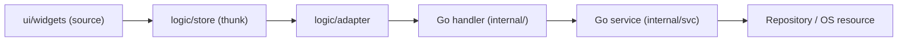
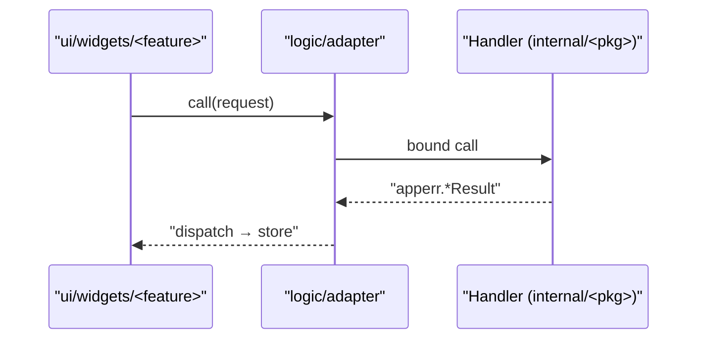
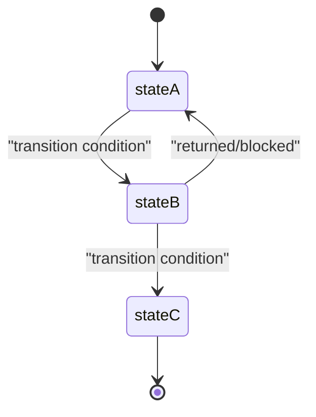
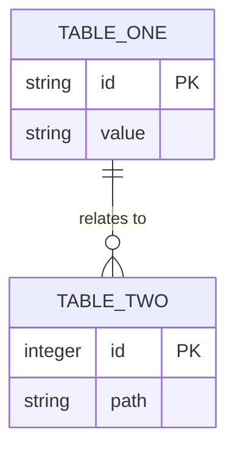

# Diagram Skeletons

Copy-paste starting points — each is empty-but-valid Mermaid using real inventory-style module names
as placeholders. Replace the placeholder nodes/participants/entities with the ones your diagram
actually needs; keep the quoting and `end`-matching structure intact.

## Flowchart (`flowchart LR`) — use for a use-case or data flow

Use for: the inward-pointing `thunk → adapter → handler → service → repository` path, or any other
layered/pipeline flow. Swap `LR` for `TD` when depicting layered architecture rather than a
left-to-right pipeline.

## Sequence diagram (`sequenceDiagram`) — use for a request/response or event interaction

Use for: interactions and event streams — an agent progress/stream loop, an `OnFileOpen`/drag-and-drop
routing sequence, a settings save round-trip.

## State diagram (`stateDiagram-v2`) — use for a lifecycle

Use for: lifecycles — the story lifecycle (`draft → ready → in-progress → done → superseded`), a
document's clean/dirty/saving states, a provider-verification draft-config state machine.

## Entity-relationship diagram (`erDiagram`) — use for related tables

Use for: persisted schema — the `settings(key, value, type)` KV table, the recent-files table, or (in
Stage 3) the additive `providers` table. Drop the relationship line entirely if the tables don't
actually relate in the schema.
