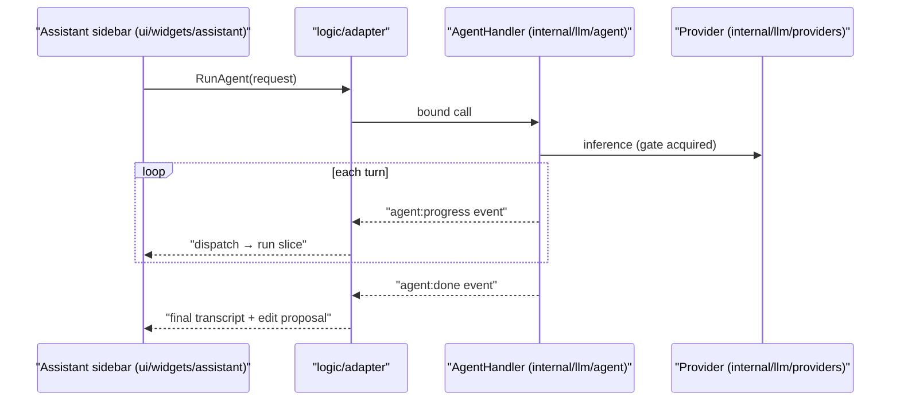
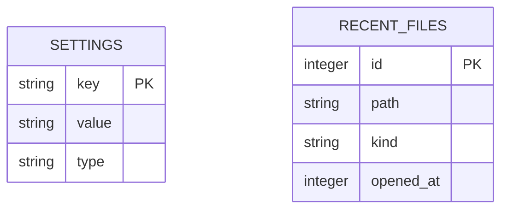

```mermaid
flowchart LR
    widget["UI widget (ui/widgets)"] --> thunk["Redux thunk (logic/store)"]
    thunk --> adapter["logic/adapter (unwrap / guardArity)"]
    adapter --> bind["wailsjs binding (IPC)"]
    bind --> handler["Go handler (apperr.*Result, no ctx)"]
    handler --> service["Go service ((T, error))"]
    service --> repo["Repository / OS resource"]
    repo -->|"(T, error)"| service
    service -->|"apperr.*Result"| handler
```

```mermaid
stateDiagram-v2
    [*] --> clean
    clean --> dirty: "user edits"
    dirty --> saving: "save or autosave"
    saving --> clean: "write succeeded"
    saving --> dirty: "write failed; content preserved"
    dirty --> conflicted: "file changed on disk"
```

# GoMarkEdit Worked Examples

Four concrete, in-repo-style examples — one per diagram type — to copy the shape of rather than
inventing conventions from scratch. Each uses real module/layer names from
`specification/02_Architecture/01_MODULE_INVENTORY.md`.

> **A note on scope.** These diagrams are authored **into the spec's Markdown** as documentation —
> they are read by humans browsing `specification/`. This is a different concern from
> `ui/components/MermaidBlock`, which is the GoMarkEdit **product's own runtime renderer** for a
> `mermaid` fenced block that appears inside a *user's* Markdown document in the live preview. Both
> use the same Mermaid syntax, but this skill never touches `MermaidBlock` code — it only writes
> diagram source into spec files.

## 1. Inward-pointing data flow (`flowchart LR`)

````markdown

````

Only `logic/adapter` may import `wailsjs/`; the handler returns a Result envelope and takes no `ctx`.
For an `internal/appmodel` **command**, add the reconciliation edge: the model mutates and emits a
`state:patch` event that updates the Redux projection (DD-62/DD-63) — the thunk's envelope carries no
model data. This mirrors the canonical embedded flowchart in
`specification/02_Architecture/01_SYSTEM_ARCHITECTURE.md` — reuse this exact left-to-right shape for
any other inward-pointing flow (e.g. `internal/docs/` open/save, `internal/workspace/` folder scan).

## 2. Agent progress/stream events (`sequenceDiagram`)

````markdown

````

Every `loop` opener has a matching `end`; participant aliases (`UI`, `AD`, `AH`, `PR`) are short valid
ids while the quoted `as "..."` labels carry the real module names. Use this shape for any
request/response or event-stream interaction — e.g. an OS file-open via `Mac.OnFileOpen` or
`internal/fileassoc`'s drag-and-drop routing.

## 3. Story lifecycle (`stateDiagram-v2`)

````markdown

````

Note `inProgress` (no hyphen) as the state **id**; the human-readable label `in-progress` lives only
in the transition text, since hyphens aren't valid in a bare id. This depicts a document's save
lifecycle from `01_Product/03_FILES_TABS_WORKSPACE.md#dirty-state`; the same shape suits any other
state machine in the spec.

## 4. Settings KV + recent files (`erDiagram`)

````markdown

````

Mirrors the generic `settings(key, value, type)` KV table used by `internal/settings/` and the
bounded, MRU-ordered list owned by `internal/recent/`. Add a relationship line (e.g. `SETTINGS ||--o{
RECENT_FILES : ...`) only if the tables actually relate — don't force a relationship that doesn't
exist in the schema just to make the diagram look more connected.
