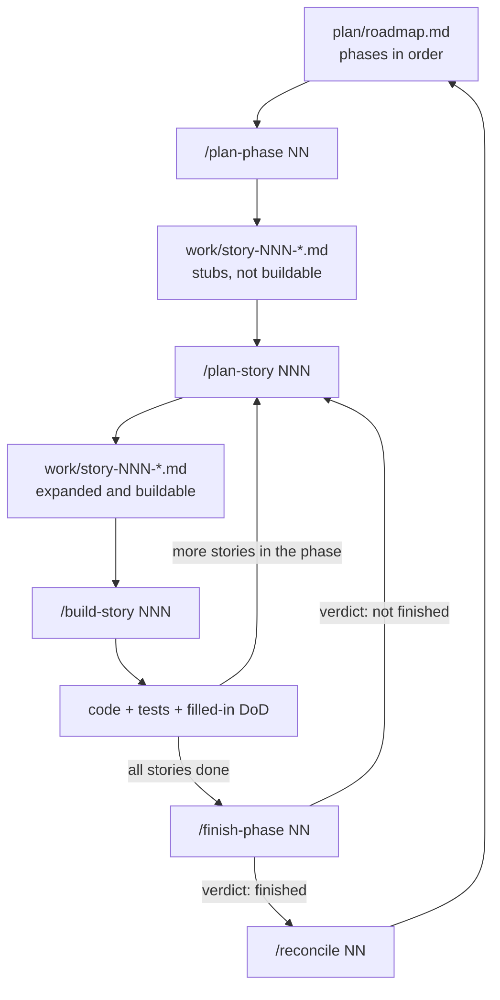

# How to work with this specification

This is the operating manual. The specification says what to build; this file says how work moves
through it, which command to run when, what each one leaves on disk, and what to do with the result.

Read it once. After that, every command ends by telling you what comes next.

---

## The loop, in one picture



One phase at a time. Inside a phase, one story at a time, all the way through build before planning
the next one — planning every story up front means planning most of them against assumptions the first
build will overturn.

---

## The commands

### `/plan-phase NN` — turn a phase into a list of stories

**Run it when** you are starting a phase: the previous phase has a verdict of *finished*, or this is
the first phase in the project.

**Before you run it**, read `docs/delivery/plan/phase-NN-*.md` yourself. If its
`## Questions to settle first` section has entries, the command will stop and ask you about them, and
answering well is the highest-value thing you do all phase.

**What it does.** Reads the phase and every feature file it names under `## Where the details are`, in
full. Stops and asks about anything unresolved or contradictory. Slices the work into vertical
stories — each one delivering something a user can observe in the running app, reaching from a Go
handler through the binding to a React widget. Checks coverage three ways. Writes a stub file per
story.

**What you get.** One file per story at `docs/delivery/work/story-NNN-<slug>.md`, each marked:

```markdown
**STATUS:** stub — not buildable. Run `/plan-story NNN` to expand.
```

A stub is a *placeholder with enough context to judge the slicing* — the outcome in prose, and a
one-line summary of each rule it owns carrying that rule's real values. It is deliberately not
buildable, and `/build-story` refuses it.

**What to do with it.** Read the story list and check the slicing before going further. This is the
cheapest moment to disagree. Look for: a story that delivers only a layer (a Go service with no way to
reach it, a React component with nothing behind it), a story that owns **more than five rules** — too
big, ask for a split — and anything in the phase's features that no story owns.

**Then run:** `/plan-story NNN` for the first story in dependency order.

---

### `/plan-story NNN` — expand one stub into something buildable

**Run it when** the previous story in the phase is built and verified, or this is the first story of
the phase. One at a time.

**What it does.** Opens the stub for exactly that number and expands it **in place**. Copies each
owned rule out of its feature file **whole** — every clause, every table row, every example. Writes
`## How it works now` from the existing code. Decides which files the work touches. Matches those
paths against every `Applies to` glob in `docs/delivery/architecture/rules.md` and copies the matching
rules in, showing the match table. Renders the Definition of Done with a named test file and function
per rule. Writes the walkthrough.

**What you get.** The same file, now self-contained: rules with their real values, technical
constraints, exact file paths, a rule-to-test table, a walkthrough, and what it unblocks. The status
line becomes `**STATUS:** planned — ready to build.`

**How to check it before building.** Run:

```bash
just story-check NNN
```

That compares every copied rule against its source line by line, counts table rows on both sides,
recomputes the architecture glob match independently, resolves every anchor, and counts the rules
against the ceiling of five.

A copy that lost a table row is the most expensive failure in this whole workflow and it is invisible
to every check downstream. **This is the one that catches it.** STORY-058 was built from a copy of
`themes-and-appearance.md#theme-identity-is-stable` carrying 11 of the rule's 24 rows; the ten tokens
named in the missing rows have zero occurrences in the shipped stylesheet, and every gate was green.

Then apply the human test: **could a stranger build this with nothing else open?** If the answer needs
a "well, they'd also need to look at…", it is not finished.

**Then run:** `/build-story NNN`.

---

### `/build-story NNN` — implement it

**Run it when** the story is expanded and `just story-check NNN` is clean.

**What it does, in order.**

1. **Refuses a story that is not ready** — still marked stub, no `## Technical constraints`, a rule
   with no body, or no rule-to-test table. It stops rather than filling the gap, because filling it
   means authoring requirements inside an implementation session with nobody reviewing them.
2. **Captures a baseline before touching anything** — `just baseline STORY-NNN`. Records the commit,
   every currently failing test by name, every static-analysis finding as `file:rule:message`,
   coverage, and **the exit code and reliability verdict of every gate**. Raw output is kept in
   `story-NNN.logs/`.
3. **Checks the baseline is trustworthy.** A gate that exited non-zero but produced no findings did
   not run — it crashed, or found no files to analyse. That is a hard stop, not a footnote, because a
   diff against an empty baseline passes no matter what you write.
4. Implements the story, touching only the declared paths.
5. Runs `just verify STORY-NNN` and fills in every Definition-of-Done row.

**What you get.** Code, tests carrying `// Proves: <feature>#<anchor>` on their first comment line,
and a story file whose Definition of Done is filled in top to bottom.

**What to do with it.** Read the report's last section — *what I had to decide that the story did not
cover*. Every entry there is a small specification gap that will otherwise be rediscovered later at
higher cost. Fix them in the feature file now, or record them.

Check the DoD has no blank rows. A blank row is a failure, not an omission.

**Then run:** `/plan-story` for the next story in the phase — or `/finish-phase NN` if this was the
last one.

---

### `/finish-phase NN` — decide whether the phase is actually done

**Run it when** every story in the phase reports built and verified.

**What it does.** Runs `just check`, `just e2e-test` and `just spec-check`, and pastes the output
verbatim. Opens each named test individually and confirms it exists, passes, and tests behaviour
rather than the presence of a symbol. Confirms every story in the phase is out of stub state, has no
blank DoD rows, and has a baseline with no `UNRELIABLE` gate. Then launches a **real build** —
`just build`, not `wails dev`, which serves a mock bridge with a different log level and a different
configuration folder — and walks the phase's "Done when" paragraph step by step, reporting what
actually happened at each step rather than that it was done. Records the run.

**What you get.** A verdict, a live-test report at `docs/delivery/plan/testing/reports/<date>.md`, new
rows in `live-plan.md`, and new entries in `docs/delivery/plan/KNOWN_ISSUES.md`.

**What to do with it.** The verdict is binary. *Finished with caveats* is not a verdict — it teaches
everyone that the gate is negotiable, and it is how a phase ships broken. If something does not hold,
the phase is not finished: plan a story for it and come back.

**Then run:** `/reconcile NN` — before starting the next phase, not later.

---

### `/reconcile NN` — put the documents and the code back in agreement

**Run it when** a phase has a verdict of *finished*. Also run it any time you suspect drift — after a
hotfix, after a merge, or when something in the spec reads as untrue.

**What it does.** Diffs what actually shipped against what `spec/` and `architecture/` say, runs
`just story-check` over every story in the phase to find truncated rule copies, and resolves every
difference in exactly one of three directions:

| The difference | Resolution |
|---|---|
| The document was right, the code is wrong | A defect. It goes into `KNOWN_ISSUES.md` and gets a story. |
| The code was right, the document is stale | Propose the edit, **with the reason**. You approve it, then it is made. |
| Both are wrong | An open question in the feature file. Nothing is written until it is answered. |

**What you get.** A list of differences with a proposed direction for each, and — after your
approval — edits to `spec/` or `architecture/`.

**What to do with it.** This is the only step where a normative document may change to match reality,
and it happens with you looking at it. That constraint is the entire point: drift is not caused by
documents being wrong, it is caused by documents being corrected quietly.

**Then run:** `/plan-phase` for the next phase in `plan/roadmap.md`.

---

## What lives where

| Path | What it is | Who edits it |
|---|---|---|
| `docs/delivery/spec/product/*.md` | What the software does. One file per feature. **Normative.** | You, and `/reconcile` with your approval |
| `docs/delivery/spec/surface/mockup.html` | Every screen and state, six palettes × light/dark. **Normative, Tier A.** | You |
| `docs/delivery/spec/constraints.md` | Rules every feature obeys. **Normative.** | You |
| `docs/delivery/architecture/` | `README`, `stack`, `structure`, `rules`, `release`, `patterns/`. **Normative.** | You |
| `docs/delivery/adr/` | One file per consequential decision, with the options and why. | Anyone, append-only; accepted records are superseded, never edited |
| `docs/delivery/plan/roadmap.md` | Phases 00–13, in order. | You |
| `docs/delivery/plan/phase-NN-*.md` | One per phase. | You |
| `docs/delivery/plan/KNOWN_ISSUES.md` | Real defects, with the phase that fixes each. | Any command |
| `docs/delivery/plan/testing/` | The live plan and dated run reports. | `/finish-phase` |
| `docs/delivery/work/story-NNN-*.md` | Stories, stub then expanded then built. | The planning commands |
| `docs/delivery/work/archive/` | Built stories, and the story-number discontinuities. | `/reconcile` |
| `docs/delivery/work/baselines/` | What was already broken before each story, with exit codes and raw logs. | `/build-story` |
| `docs/_archive-2026-07-28-specification/` | The pre-conversion specification. **Historical, not normative.** | Nobody |
| `docs/` outside `delivery/` | Ordinary project documentation. **Descriptive.** | Anyone, freely |

**Normative** means the document is the authority. Code that disagrees with it is wrong, and the
document is never edited to match the code except through `/reconcile`. That single rule is what makes
the specification worth reading six months from now.

---

## The checks, and when to run them

| Command | What it checks | When |
|---|---|---|
| `just check` | Every code gate: generated bindings, build, format, lint, types, tests, vet, architecture. | Before every commit — `lefthook` runs it too |
| `just baseline STORY-NNN` | Records what is already broken, with each gate's exit code and verdict. | Before the first edit of a story |
| `just verify STORY-NNN` | Re-runs the gates and diffs them against that baseline. Refuses an `UNRELIABLE` baseline. | When the story's code is done |
| `just story-check NNN` | One story: stub state, copy fidelity row by row, architecture glob match, anchors, rule count. | After `/plan-story`, before `/build-story` |
| `just spec-check` | The whole tree: writing rules, revision level, every `// Proves:` tag. | Before finishing a phase |
| `just e2e-test` | Playwright journeys, against the mock bridge. | Before finishing a phase |
| `just archtest` | The boundaries nothing else can check. **Never diffed. Must be green.** | Part of `just check` |

`just spec-check` and `just story-check` are deliberately **not** part of `just check`. Documentation
drift is worth knowing about, but it is not a reason to block a commit that changes code.

---

## Rules that are not negotiable

1. **Planning writes files.** No planning command uses plan mode. A plan held in a conversation cannot
   be reviewed, cannot be diffed, and does not survive the session.
2. **A stub is not buildable.** `/build-story` refuses one. If you want a story built, expand it first.
3. **A story is self-contained.** If building it requires opening the feature file, the story is
   unfinished — that is a defect in the planning step, not something to work around.
4. **Copies are exact.** A rule copied into a story with one table row missing produces code that is
   missing that row, and every check downstream passes.
5. **A rule is never weakened to make a check pass.** If a rule is wrong or impossible, stop and say
   so. Editing the specification to match the code is the failure this whole structure exists to
   prevent.
6. **A gate that did not run is not a gate that passed.**
7. **A built story is history.** It is never re-planned to look correct after the fact. What its copy
   lost becomes a new story, and the built one gets a line saying what was lost.

---

## When something goes wrong

| Symptom | What it actually means | Do this |
|---|---|---|
| The agent asks a question you cannot answer without opening two files | It is speaking in anchors | Point it at the `## Communication` section of `AGENTS.md` |
| The story is enormous and the build stalls halfway | The slice was too big | Split it: `/plan-story` on a narrower stub, move the rest to a new story |
| A gate passes but the feature is visibly broken | The gate is measuring nothing | Read `work/baselines/story-NNN.exit`. A line containing `=UNRELIABLE=` means it never ran |
| `just verify` refuses to run | The baseline has an `UNRELIABLE` gate, or predates exit-code recording | Fix the gate, then `just baseline STORY-NNN` again. Do not work around it |
| Code and spec disagree and nobody knows which is right | Drift, caught late | `/reconcile NN`. Never resolve it by editing the spec quietly |
| The implementer keeps inventing decisions | The feature file has gaps | The gaps are listed in the build report's last section. Close them there |
| A story cannot be written self-contained | The feature file is missing something | It goes back to the feature file. Do not let the story go hunting instead |
| A shipped feature is missing part of a rule | The rule was copied truncated | `just story-check NNN` names the rows. The gap becomes a new story, not a rewrite of the old one |

---

## Starting from where this project is

Phase 00 and Phase 01 are built. Phase 02 is in progress: STORY-058 is built, STORY-062 and
STORY-059 to STORY-061 are not.

```
1. /plan-story 062  →  just story-check 062  →  /build-story 062
2. /plan-story 059  →  just story-check 059  →  /build-story 059
3. Repeat for 060 and 061.
4. /finish-phase 02
5. /reconcile 02
6. /plan-phase 03
```
