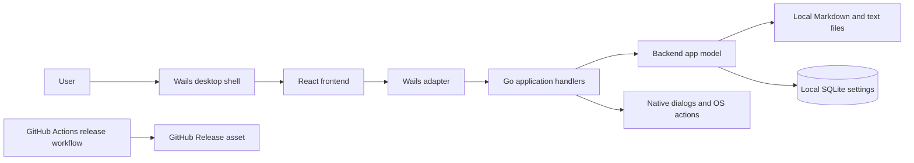

# GoMarkEdit

> GoMarkEdit is an offline-first desktop Markdown editor and viewer that edits files in place and keeps application state locally.

## 1. Service Identity Card

| Field                   | Value                                                                             |
| ----------------------- | --------------------------------------------------------------------------------- |
| **Service Name**        | GoMarkEdit                                                                        |
| **Service ID**          | `gomarkedit`                                                                      |
| **Purpose**             | Edit and preview local Markdown and text files in a native desktop application.   |
| **Domain**              | Local document editing and authoring                                              |
| **Keywords & Synonyms** | Markdown editor, Markdown viewer, desktop editor, folder workspace                |
| **Owner / Team**        | TODO: confirm; repository history identifies Oleksandr Kostenko as a contributor. |
| **Technology Stack**    | Go 1.25.7, Wails v2, React 19, TypeScript, Vite, SQLite via `modernc.org/sqlite`  |
| **Repository**          | `github.com/sanyokkua/go_mark_edit`                                               |
| **License**             | MIT (`LICENSE`)                                                                   |

## 2. Architecture Overview

GoMarkEdit is one Wails desktop process. `main.go#main` composes Go-owned application state, file services, SQLite persistence, native integrations and Wails handlers. The React frontend renders that state and sends commands through `frontend/src/logic/adapter/`; generated Wails bindings are only reached there. The Redux store is a disposable projection. Markdown files remain the source of truth for document content.

The application reads and writes user-selected local files, persists settings and UI metadata in a local SQLite database, and uses operating-system dialogs, clipboard, file-manager and browser integrations when the user asks. App runtime makes no background network request, telemetry call or update check. GitHub is used by the release workflow, not by the running application. Markdown preview supports Minimal, GFM and Full standards, with local highlighting, math and Mermaid; Format, Compact and Lint operate on the active editor working copy. Preview and editor links share the normal open flow for supported local Markdown files anywhere on disk. Remote images retain their placeholder; remote rendering consent remains out of scope.



## 3. Entry Points (Inputs)

| Entry point          | Type and trigger                                                                                                                                                                                                        | Contract / owner                                                                                                                              | Authentication                                                                                                             |
| -------------------- | ----------------------------------------------------------------------------------------------------------------------------------------------------------------------------------------------------------------------- | --------------------------------------------------------------------------------------------------------------------------------------------- | -------------------------------------------------------------------------------------------------------------------------- |
| Desktop launch       | Native process startup; the first non-flag argument, a file or a folder, is accepted by the starting window and opened by the frontend after bootstrap. Every other path from the operating system starts a new window. | `main.go#main`, `internal/application/application_context_holder.go`                                                                          | Local user session; no application account.                                                                                |
| Native dialogs       | User selects a Markdown/text file, save target, or folder.                                                                                                                                                              | `main.go#main`, `internal/application/document_dialogs.go`                                                                                    | Operating-system dialog permissions.                                                                                       |
| Wails command bridge | Frontend commands for document, settings, layout, workspace and lifecycle operations.                                                                                                                                   | `internal/appmodel/handler.go`, `internal/application/handler.go`, `frontend/src/logic/adapter/`                                              | In-process webview bridge; request identity and result envelopes are defined in `internal/bridge/` and `internal/apperr/`. |
| Reading mode         | User toggles Distraction-free reading with Ctrl+Enter (Cmd+Enter on macOS) or the View menu.                                                                                                                            | `frontend/src/logic/store/readingSlice.ts`, `frontend/src/ui/widgets/EditorStage/EditorStage.tsx`, `frontend/src/ui/widgets/ReadingControls/` | Local user session; window state only, never persisted.                                                                    |
| Export to PDF        | User chooses File, Export to PDF… or presses Ctrl+P (Cmd+P on macOS) with a document open.                                                                                                                              | `frontend/src/app/usePdfExport.ts`, `frontend/src/ui/widgets/PrintDocument.tsx`, `internal/application/handler.go#PrintWindow`                | Local user session; unavailable with no document or while a dialog is open.                                                |
| Native file drop     | User drops file or folder paths onto the app window.                                                                                                                                                                    | `internal/application/options.go`, `frontend/src/logic/adapter/events.ts`, `frontend/src/app/useDropHandler.ts`                               | Operating-system delivered paths.                                                                                          |
| Build and test CLI   | Developer invokes setup, build, test, verification or baseline scripts.                                                                                                                                                 | `scripts/build`, `scripts/test`, `scripts/verify`, `scripts/baseline`                                                                         | Local shell environment.                                                                                                   |
| Release trigger      | Push of a version tag or manual workflow dispatch.                                                                                                                                                                      | `.github/workflows/release.yml`                                                                                                               | GitHub Actions permissions; release publishing uses the workflow-provided token.                                           |

There are no HTTP, gRPC, GraphQL, webhook or message-queue endpoints in the desktop application.

## 4. Exit Points (Outputs)

| Output                  | Target and schema                                                                                                                                                | Semantics / conditions                                                                                                                                                                                                                                                                                                                                                                  |
| ----------------------- | ---------------------------------------------------------------------------------------------------------------------------------------------------------------- | --------------------------------------------------------------------------------------------------------------------------------------------------------------------------------------------------------------------------------------------------------------------------------------------------------------------------------------------------------------------------------------- |
| Document read/write     | The local path selected by the user; text bytes are encoded by `internal/file/codec.go#EncodeDocument` and writes go through the file owner in `internal/file/`. | Open reads one document on user action. Save and Save As write only after the app's revision/conflict checks; atomic replacement protects existing content.                                                                                                                                                                                                                             |
| Application persistence | OS user configuration directory, under `GoMarkEdit` or `GoMarkEdit-Dev`; SQLite `settings(key,value,type)`.                                                      | Stores settings, recent-item history, layout and content-free file metadata. Document text and credentials are not stored there.                                                                                                                                                                                                                                                        |
| Diagnostic logs         | `logs/` beside the application database.                                                                                                                         | Local rotating logs; configured during startup in `main.go#main` and `internal/logging/`.                                                                                                                                                                                                                                                                                               |
| Frontend projection     | Wails state-patch and command-result envelopes.                                                                                                                  | Keeps the UI synchronized with backend-authoritative state; contracts are in `internal/bridge/`, `internal/apperr/` and `frontend/src/logic/adapter/`.                                                                                                                                                                                                                                  |
| Operating-system action | Native file/folder/save dialogs, clipboard, file manager reveal, external browser and window lifecycle.                                                          | Performed in response to user actions or app lifecycle. Preview link handling validates/refuses unsupported schemes before opening an external browser.                                                                                                                                                                                                                                 |
| Print dialog (PDF)      | The operating system's print dialog, opened by `runtime.WindowPrint` through `ApplicationHandler.PrintWindow`.                                                   | Prints a hidden copy of the active document's flushed text rendered as the preview renders it, after its content has rendered (at most 10 seconds); the user saves a PDF or prints, and cancelling writes nothing. macOS 11 is the minimum because printing works only from there; the macOS dialog starts in landscape and can be switched to portrait. There is no silent PDF writer. |
| Release artifact        | `GoMarkEdit-<version>-macos-arm64.zip` attached to a GitHub Release for eligible version tags.                                                                   | CI-only output from `.github/workflows/release.yml`; manual dispatch uploads an artifact without publishing a release.                                                                                                                                                                                                                                                                  |

## 5. Data Flow

1. `main.go#main` creates the local logger, file path service, database, repositories, application model and Wails handlers.
2. The backend publishes an initial state snapshot. The frontend hydrates from it and renders documents, settings, tabs, preview and folder controls.
3. A user command crosses the adapter into a Wails handler. The handler validates request identity, delegates to the owning service and returns a typed result; successful state changes are published back to the frontend.
4. Opening a document canonicalizes and reads the selected path. The app model owns its identity, content revision, disk baseline and tab state. Saves verify revisions and external disk state before replacing bytes.
5. Opening a folder builds a bounded, filtered tree snapshot. Its root and tree belong to that process; only the app-wide hidden-folder preference and combined Recent Items are persisted.
6. Settings and layout repositories write to SQLite. On shutdown, pending application work is drained before the database and logger close.
7. The frontend previews the latest accepted editor buffer and runs tidy against the current editor working copy. Tidy uses a module worker behind one per-window operation slot; progress, cancellation and lint findings are ephemeral frontend state.

Detailed document lifecycle, conflict, close and shutdown flows are in [architecture.md](architecture.md#document-lifecycle), [architecture.md](architecture.md#shutdown) and [architecture.md](architecture.md#persistence).

## 6. Business Logic

### 6.1 Primary Flows

#### Open and edit a document

1. The user chooses a file through the native Open dialog, a folder tree, Recent Items, a startup path or a file drop.
2. `internal/appmodel/` canonicalizes the path, detects an already-open identity, reads bytes and decodes supported UTF-8/BOM/line-ending forms through `internal/file/`.
3. The backend creates or activates a document and publishes content-free metadata plus the active buffer through the frontend adapter.
4. The editor changes a document revision. Autosave, when enabled, writes existing files through the normal revision and external-change protections. Untitled documents use Save As.
5. Save conflicts offer explicit reload, keep-mine authorization or skip/cancel paths; close plans use the same save lifecycle.

#### Open and browse a folder

1. The user chooses a folder, drops a folder, uses Recent Items, or requests a new window for it.
2. `internal/appmodel/workspace.go` validates the root and asks `internal/workspace/tree.go` for a bounded snapshot.
3. The tree includes supported Markdown/text files and folders; hidden files are excluded and hidden folders follow the persisted Show hidden folders setting. Refresh is user initiated; there is no filesystem watcher.
4. Clicking a file opens it through the ordinary document lifecycle. Folder replacement and close coordinate with the existing document close/save plan.
5. Tree actions can create a supported file or folder, copy its path, or reveal it in the OS file manager.

#### Export to PDF

1. With a document open, the user chooses File, Export to PDF… or presses Ctrl+P (Cmd+P on macOS). `useShellShortcuts` always prevents the webview's own print for this shortcut; with no document or a dialog open nothing else happens.
2. `app/usePdfExport.ts` flushes the active editor session, reads the backend's copy of the text with `appModelAdapter.getState()` (unsaved and Untitled text included) and mounts `ui/widgets/PrintDocument.tsx`, a hidden copy portaled into `document.body` outside `#root`. It renders the preview renderer (`LazyMarkdownView`) with the current Markdown standard and the same local-image resolver as the preview, so placeholders and limits match and the arrangement, scroll position and a paused preview do not matter.
3. The hook polls every 100 ms until the copy is mounted and holds no `[data-print-pending]` element, or 10 seconds pass, then calls `windowAdapter.printWindow()` (`ApplicationHandler.PrintWindow`). A second request while one is waiting is ignored.
4. `@media print` hides every other child of `body` and shows the copy with its own padding and background (`print-color-adjust: exact`); there is no `@page` rule. The copy stays mounted until the next export or an active-document change. Exporting changes no document, modified state, arrangement or Reading mode.

#### Persist application preferences

1. User changes settings or window layout.
2. The backend validates and acknowledges the change.
3. Settings, layout, Recent Items and per-document view metadata are stored in SQLite; document content stays in the original local files.

Default open mode (Editor by default, or Reading (Viewer), stored as `viewer`) is selectable in both the Settings menu and the Settings dialog; both show the stored choice, Reset appearance restores Editor, and it survives restart. With Reading (Viewer), a file opened from disk (Open dialog, Open Recent, the launcher, Reopen Last, the workspace tree, a preview link or drag and drop) opens in Reading mode and keeps its saved arrangement for when Reading mode is left; focusing an already open file does not enter Reading mode, and a file created with New File in the tree opens for editing.

Reading mode hides all chrome and shows only the rendered active document; Ctrl+Enter (Cmd+Enter on macOS) or View, Distraction-free reading enters and leaves it, and it is never stored. Hover- or focus-revealed controls (Exit, and sidebar and tab-bar overlays) appear along the window edges; Ctrl/Cmd+\ toggles the sidebar overlay without changing the stored sidebar. Escape closes an open overlay first and then leaves Reading mode. The preview context menu (Copy, Select all) is available in the preview and in Reading mode.

Reading width (Page by default, or Full width, stored as `page` or `full`) is also selectable in both the Settings menu and the Settings dialog. Page shows the Reading mode document as a centered column at most 700 px wide; Full width uses the whole window width minus its padding. A new choice applies at once, including while Reading mode is active, Reset appearance restores Page, and it survives restart.

PDF appearance (Styled by default, or Clean, stored as `styled` or `clean` under `export.pdfAppearance`) is selectable in both the Settings menu and the Settings dialog. Styled exports in the theme and mode shown on screen; Clean prints the copy in the Material Light palette (black text on white, light Mermaid diagrams) whatever the theme or mode, and the screen keeps its theme. Reset appearance restores Styled, and the choice survives restart.

**State model:** document tabs and folder workspace are process state. There is no session/tab restore or crash-recovery file. Recent Items and window/application layout persist across launches.

In Split mode, drag the editor/preview divider to change the editor's share from 20 to 80 percent.
The focused divider supports Left/Right, Home and End. Each saved file remembers its ratio when
reopened, including after restart; untitled files remember it while open and persist it when saved.
Monaco's built-in Find/Replace searches the active editor document: Ctrl/Cmd+F opens Find and
Ctrl/Cmd+R opens Replace, alongside Monaco's standard Replace shortcuts. Find works on read-only
files; replacements use ordinary editing, undo, live preview and saving.

### 6.2 Error Handling and Edge Cases

| Scenario                                        | Behavior                                                                                            |
| ----------------------------------------------- | --------------------------------------------------------------------------------------------------- |
| File path aliases an already-open file          | Stable file identity focuses the existing tab instead of duplicating it.                            |
| File changes outside the app                    | Disk version checks block unsafe writes and route through an explicit conflict decision.            |
| Folder tree exceeds its configured entry budget | The snapshot is marked truncated; it does not traverse without a bound.                             |
| Folder or descendant cannot be read             | The UI receives an unavailable state or an unreadable node, depending on which path failed.         |
| Unsupported dropped path                        | It is classified without opening or changing app state.                                             |
| Unsupported preview URL scheme                  | It is refused; only allowed user-activated external links are delegated to the OS browser.          |
| Persistent database is corrupt                  | Startup preserves the corrupt file and reports recovery failure instead of silently overwriting it. |

## 7. External Services and Dependencies

| Dependency                       | Type                              | Purpose                                                                                          | Criticality / failure behavior                                                                            |
| -------------------------------- | --------------------------------- | ------------------------------------------------------------------------------------------------ | --------------------------------------------------------------------------------------------------------- |
| Wails v2 and native webview      | In-process desktop framework      | Native window, Go/React bridge, dialogs, events and menus.                                       | Required to run the desktop application.                                                                  |
| Operating system                 | Local APIs                        | User config paths, file access, dialogs, clipboard, file manager, browser and window management. | Required for corresponding native actions; failures are returned through classified outcomes.             |
| SQLite (`modernc.org/sqlite`)    | Embedded local database           | Persist settings and content-free application metadata.                                          | Required for startup persistence; migrations are additive.                                                |
| GitHub Actions / GitHub Releases | CI service, release workflow only | Verify, build and attach the macOS release archive for eligible tags.                            | Not contacted by the running application. Release trigger and workflow failures are visible in Actions.   |
| Go modules and npm packages      | Build-time dependencies           | Compile Go backend and React frontend.                                                           | Setup/build may need network access; installed app runtime does not use them to make background requests. |

**Integration map**

- Upstream: local user through native UI, command bridge, startup arguments (a file or folder for the starting window; any other external path starts a new window) and OS file-drop events.
- Downstream at runtime: local files, user configuration database/log directory, operating-system dialog/clipboard/file-manager/browser APIs.
- Shared infrastructure: none beyond the local OS filesystem and SQLite.
- Events consumed: Wails lifecycle and file-drop events; app-owned frontend state/error events.
- Events published: backend state patches, classified command outcomes and native close requests.
- External app services: none during ordinary app runtime. GitHub Actions is used only for CI/release automation.

## 8. Data Contracts and Domain Models

| Contract                                     | Main fields / meaning                                                                                                                                                            | Owner                                                                        |
| -------------------------------------------- | -------------------------------------------------------------------------------------------------------------------------------------------------------------------------------- | ---------------------------------------------------------------------------- |
| `apperr.DocumentMetadata`                    | Document ID, title/path/display name, dirty state, encoding/BOM/line ending, content revision, write/conflict status and view state. It intentionally excludes document content. | `internal/apperr/results.go`                                                 |
| `file.DocumentSnapshot`                      | Canonical text plus UTF-8 encoding, BOM and line-ending metadata used to preserve source bytes.                                                                                  | `internal/file/codec.go`                                                     |
| `file.DiskVersion`                           | Existence, size, mtime, permissions and optional stable file identity used for safe-write and external-change checks.                                                            | `internal/file/disk_version.go`                                              |
| `apperr.RecentItem`                          | Local path plus `file` or `folder` kind in the combined most-recently-used list.                                                                                                 | `internal/apperr/results.go`, `internal/appmodel/recent_files_repository.go` |
| `apperr.WorkspaceSnapshot` / `WorkspaceNode` | Root path/name, filtered tree, entry count, truncation/unavailable flags and hidden-folder preference.                                                                           | `internal/apperr/results.go`; tree builder in `internal/workspace/tree.go`   |
| `apperr.UILayout`                            | Optional window/sidebar/pane dimensions and visibility/arrangement values; pointer fields preserve explicit false/zero values.                                                   | `internal/apperr/results.go`                                                 |
| Bridge request/result                        | Request identity guards duplicate commands; typed result envelopes include success or classified failure/remediation.                                                            | `internal/bridge/`, `internal/apperr/`                                       |

The Go backend is the source of truth for application state. The Redux store mirrors that state and may be rebuilt from backend snapshots.

## 9. Configuration

| Configuration                    | Source                             | Runtime key / path                          | Meaning                                                                                                                                               |
| -------------------------------- | ---------------------------------- | ------------------------------------------- | ----------------------------------------------------------------------------------------------------------------------------------------------------- |
| User data root                   | `os.UserConfigDir()`               | `GoMarkEdit/` or `GoMarkEdit-Dev/`          | Contains `settings.db` and `logs/`; exact root is OS-specific.                                                                                        |
| Development application identity | Build/dev mode                     | `GoMarkEdit-Dev`                            | Keeps development persistence separate from production.                                                                                               |
| E2E headless mode                | Test harness process               | `GOMARKEDIT_E2E_HEADLESS=1`                 | Suppresses showing a native window in supported E2E startup paths; not a user product setting.                                                        |
| Go toolchain                     | `go.mod`                           | `go 1.25.7`                                 | Go toolchain requirement.                                                                                                                             |
| Node toolchain                   | `.nvmrc`                           | Version in file                             | Frontend setup/build requirement.                                                                                                                     |
| Release version                  | Git tag or workflow-dispatch input | `X.Y.Z`, `X.Y.Z-alpha.N`, or `X.Y.Z-beta.N` | Stable tags publish ordinary releases; alpha/beta tags publish prereleases. Only tagged commits on `master` pass the release workflow's branch guard. |

There are no application runtime API keys, service URLs or account credentials. No secret values belong in repository documentation. The release workflow uses GitHub's provided token permission to create a release.

Markdown preferences share the existing settings group in SQLite: standard (`full` by default), bullet marker (`-`), emphasis marker (`_`), heading style (`atx`), Format on save (off) and Lint on save (on). The backend owns defaults and validation; missing or invalid values fall back to defaults. The existing settings table and bridge calls are reused, with no migration.

## 10. Project Structure and Operation

### 10.1 Repository Layout

```text
main.go                     Wails composition root
internal/appmodel/          Backend-authoritative document, tab, close and workspace state
internal/application/        Wails handlers, native ports, startup and shutdown lifecycle
internal/file/              File paths, codecs, identity, atomic writes and OS file actions
internal/workspace/         Bounded folder tree builder
internal/settings/          Settings validation and persistence
internal/db/                 SQLite open and migrations
internal/apperr/             Bridge DTOs, result envelopes and classified failures
frontend/src/app/             React application composition and workflows
frontend/src/logic/adapter/   Only frontend boundary to generated Wails bindings
frontend/src/logic/store/     Disposable frontend projection
frontend/src/ui/              Reusable UI primitives and product widgets
frontend/wailsjs/             Generated Wails bindings; regenerated by build
openspec/                     Project rules, current behaviour specs, active and archived changes
scripts/                      Canonical setup, build, test and verification entry points
.github/workflows/             Cross-platform Go CI, full verification and release automation
```

### 10.2 Build, Run and Verify

Prerequisites: Go version from `go.mod`, Node version from `.nvmrc`, npm, Wails system prerequisites, and `just` only if using the aliases.

```bash
scripts/build setup
scripts/build dev
scripts/verify
scripts/baseline --compare
```

On Windows, `scripts/build` also builds the NSIS installer when `makensis` is on `PATH` and logs that it was skipped otherwise. On Linux it copies the desktop entry, MIME file, `install.sh` and the icon next to the binary in `build/bin/`; run `install.sh` there to install per user and `install.sh --uninstall` to remove it.

Use `scripts/build setup --with-browser` to install Chromium for E2E verification. Linux desktop builds require GTK 3 and WebKit2GTK 4.1 development headers. Each verification run keeps only the 10 newest folders under `.local_tmp_files/runs/` and shares tool caches in `.local_tmp_files/cache/`. See [the E2E performance note](e2e-performance.md) for harness behavior.

### 10.3 CI and Release

- `.github/workflows/push.yml` runs Go package tests on macOS and Windows, builds Go packages, and runs the verification stages as parallel Ubuntu 24.04 jobs (static checks, unit and integration tests, and E2E in three shards). A push that changes only documentation, agent, OpenSpec or tooling-configuration files (the `paths-ignore` list in `push.yml`) skips it; any other changed file, including test fixtures, scripts and workflows, runs it. Tag releases always run.
- `.github/workflows/release.yml` requires a successful `push.yml` run for the tagged commit (or a manual dispatch with `full_verify`, which runs the complete verification on macOS), runs the macOS E2E subset and produces a macOS arm64 `.app` zip. It accepts stable, alpha and beta version forms. Manual dispatch uploads a dry-run artifact; a tagged push creates a GitHub Release.
- Cross-platform Go CI is configured, but Windows/Linux packaged release artifacts are not currently configured in the release workflow.

Platform integration: the macOS bundle declares `.md`, `.markdown`, `.mdown` and `.txt` documents and folders with Alternate handler rank, so Finder lists GoMarkEdit under Open With and a folder can be dropped on its Dock or application icon. Finder has no Open With for folders. GoMarkEdit never becomes the default by itself; the user chooses it with Get Info > Change All. Finder opens reach the backend as file-open events (D19). A file already open in a live window opens nothing, and at most 50 windows are open at once.

The Windows installer lists GoMarkEdit under Open With for those four suffixes and adds "Open with GoMarkEdit" to the context menu of a folder and of a folder's background (under "Show more options" on Windows 11); it never writes a default, and the uninstaller removes every registration it added. The Linux desktop entry declares Markdown, `text/plain` and `inode/directory`, so other text files are also listed and are refused when opened, and the file manager still opens folders itself. `install.sh` never sets a default. Windows and Linux behaviour is not verified at runtime.

## 11. Current Product Scope and Future Work

Current behaviour is specified in `openspec/specs/`; the earlier native shell, editor, real-file lifecycle, architecture refactor, folder workspace, rich Markdown, resize/find, table and conflict-comparison work is kept under `openspec/changes/archive/`.

The app provides editor, split and preview arrangements; Minimal, GFM and Full rendering with local code highlighting, math and Mermaid; document-wide Format, Compact and Lint; settings, local file operations, external-change handling and folder browsing. It opens `.md`, `.markdown`, `.mdown` and `.txt` documents. Export to PDF opens the system print dialog for a hidden copy of the active document (macOS 11 or later). The export waits (at most 10 seconds) for Mermaid diagrams to be drawn and images to load before printing. Work still deferred includes the command palette, Assistant, the Clean PDF appearance, image authoring and broader asset handling. Remote images remain placeholders until a user-consent policy is specified. Treat these as candidate work only; propose and approve an OpenSpec change and confirm priorities before implementing any item.

Future implementation work starts as an OpenSpec change on its own feature branch.

## 12. Searchability Anchors

| Anchor                    | Values                                                                                                                                                                                                                                                                                                                                                                                                          |
| ------------------------- | --------------------------------------------------------------------------------------------------------------------------------------------------------------------------------------------------------------------------------------------------------------------------------------------------------------------------------------------------------------------------------------------------------------- |
| **Functional areas**      | `#editor`, `#preview`, `#markdown`, `#tidy`, `#links`, `#files`, `#tabs`, `#save`, `#workspace`, `#recents`, `#settings`, `#release`                                                                                                                                                                                                                                                                            |
| **User-facing features**  | Markdown standards, preview, Format, Compact, Lint, local Markdown links, Open File, Save, Save As, Recent Items, Reopen Last, Open Folder, Show hidden folders, Refresh, New File, New Folder, Reveal, Copy Path, Open in New Window                                                                                                                                                                           |
| **Key code locations**    | `main.go#main`; `internal/appmodel/service.go`; `internal/appmodel/workspace.go`; `internal/file/paths.go`; `internal/workspace/tree.go`; `internal/application/handler.go`; `frontend/src/logic/adapter/`; `frontend/src/app/`; `frontend/src/ui/widgets/WorkspaceTree/`; `frontend/src/logic/markdown/`; `frontend/src/logic/markdown/mermaid/`; `frontend/src/logic/tidy/`; `frontend/src/logic/operations/` |
| **Behaviour authorities** | `openspec/specs/`, `openspec/config.yaml`, `openspec/changes/`                                                                                                                                                                                                                                                                                                                                                  |
| **Feature flags**         | No product feature-flag service is present.                                                                                                                                                                                                                                                                                                                                                                     |

## 13. Additional Notes

- `README.md` is the quick project entry point; this file is the comprehensive project map; `docs/architecture.md` records durable ownership, lifecycle, persistence and architecture decisions.
- `AGENTS.md` is the working authority for coding agents. `CLAUDE.md` and `.github/copilot-instructions.md` point to it.
- The local original specification under `.local_tmp_files/` is not versioned. `openspec/specs/` are the reviewable product contracts. Future scope and priority require owner confirmation and an OpenSpec change.
- Known documentation gap: the organizational owner/team is not stated in checked-in project metadata (`TODO: confirm`).
