# Mermaid diagram types

## Flowchart

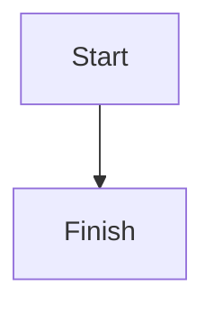

## Sequence

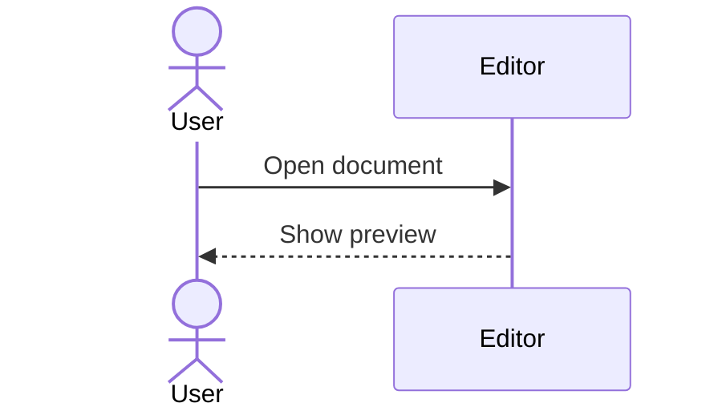

## Class

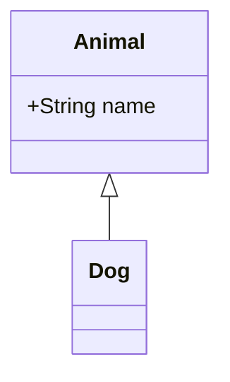

## State

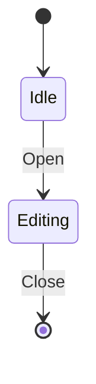

## Entity relationship

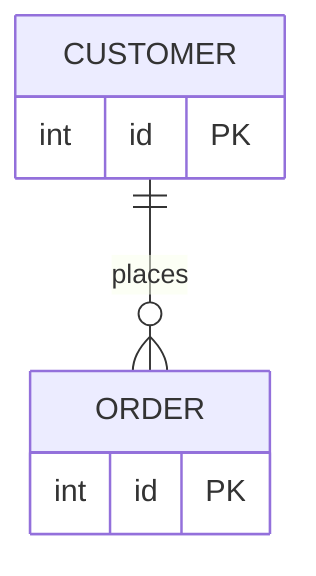

## Gantt

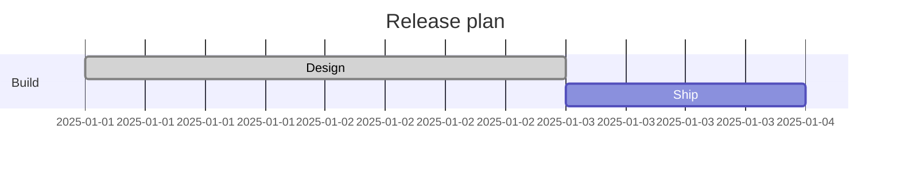

## Pie

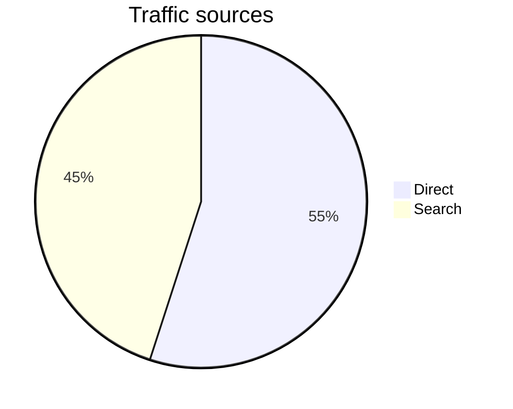

## Mindmap

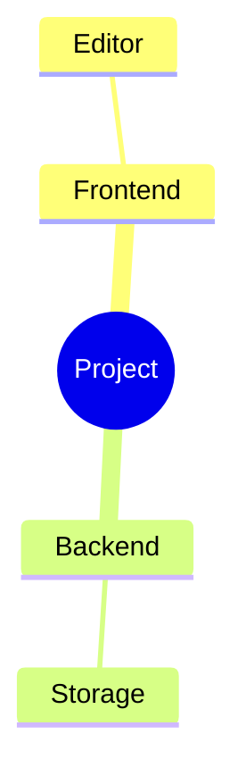

## Timeline

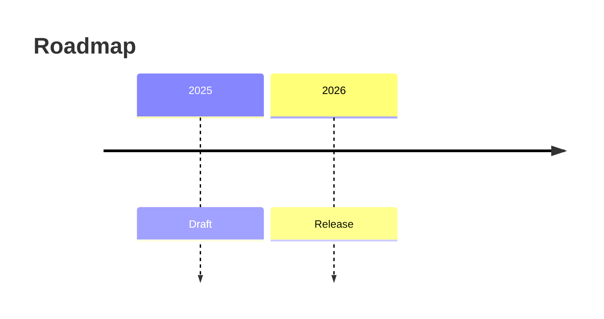

## Git graph

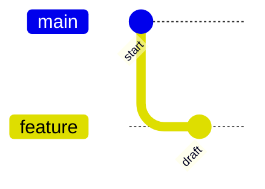

## Journey

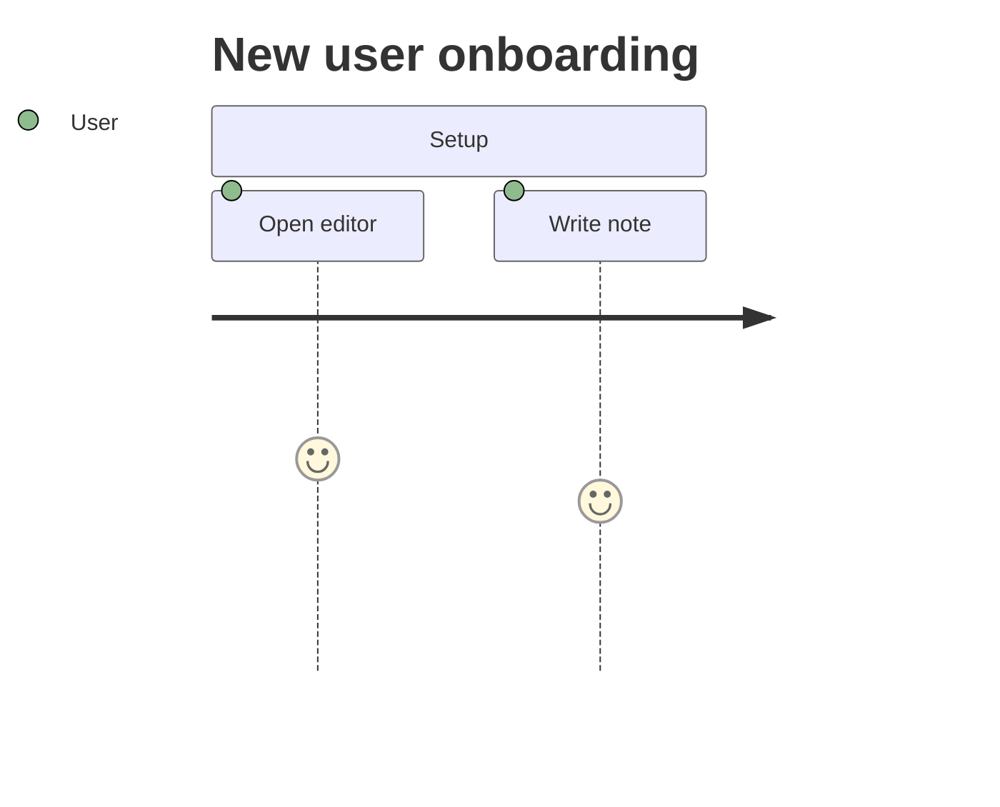

## Quadrant

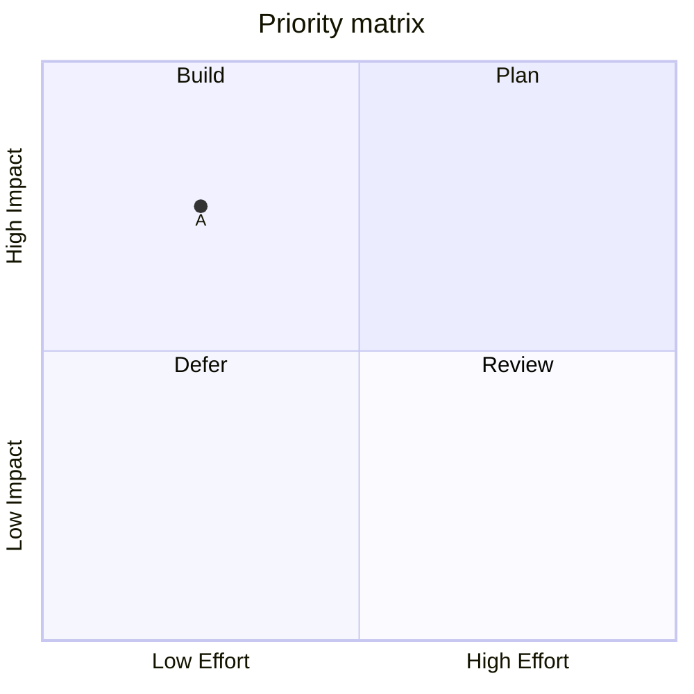
