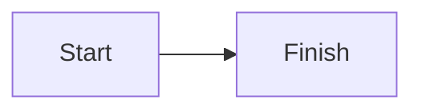

# Rich rendering reference

[see](#getting-started)
[first note](#notes) [second note](#notes-1) [about](#über-uns)

| Name | Count | State |
| :--- | ---: | :---: |
| Alpha | 12 | Ready |

- [x] Finished task
- [ ] Pending task

~~Removed wording~~ and https://example.com/reference are GFM examples.

A footnote belongs here.[^detail]

[^detail]: Footnote detail with a return link.

The price is $5 and $10, and an escaped dollar is \$5.

Inline math: $E=mc^2$.

$$
x^2 + y^2 = z^2
$$

```math
\frac{a}{b}
```

Broken inline math: $\notacommand$.

> [!NOTE]
> GitHub note body.

> [!TIP]
> GitHub tip body.

> [!IMPORTANT]
> GitHub important body.

> [!WARNING]
> GitHub warning body.

> [!CAUTION]
> GitHub caution body.

:::note
Directive note body.
:::

:::tip
Directive tip body.
:::

:::important
Directive important body.
:::

:::warning
Directive warning body.
:::

:::caution
Directive caution body.
:::

:::unknown
Unknown directive stays literal.
:::



```mermaid
flowchart LR
    A -->
```

```go
package main

func main() { println("hello") }
```

```unknown-language
unknown block stays plain
```

Allowed raw HTML: <kbd>Ctrl</kbd> <mark>marked</mark> <abbr title="Hypertext Markup Language">HTML</abbr>.

## Notes

First note heading.

## Notes

Second note heading.

## Über uns

Unicode heading.

## Getting Started

Anchor target after enough content to scroll.

<script>strip-script-sentinel</script>
<style>strip-style-sentinel</style>
<iframe>strip-iframe-sentinel</iframe>
<object>strip-object-sentinel</object>
<embed src="https://example.com/embed">
<form>strip-form-sentinel</form>
<noscript>strip-noscript-sentinel</noscript>
<template>strip-template-sentinel</template>
<textarea>strip-textarea-sentinel</textarea>
<select>strip-select-sentinel</select>
<button>strip-button-sentinel</button>
<svg>strip-svg-sentinel</svg>
<math>strip-math-sentinel</math>
<title>strip-title-sentinel</title>
<head>
<frame src="https://example.com/frame">
<applet>strip-applet-sentinel</applet>
<link href="https://example.com/stylesheet" rel="stylesheet">
<meta content="strip-meta" name="description">
<base href="https://example.com/">
<audio>strip-audio-sentinel</audio>
<video>strip-video-sentinel</video>
<canvas>strip-canvas-sentinel</canvas>
<noembed>strip-noembed-sentinel</noembed>
<noframes>strip-noframes-sentinel</noframes>
<xmp>strip-xmp-sentinel</xmp>
<dialog>strip-dialog-sentinel</dialog>
<portal>strip-portal-sentinel</portal>

<unknown-widget>Unknown wrapper text survives.</unknown-widget>
<p onclick="window.__hostileClicked = true" style="color: red">Safe paragraph survives.</p>
<a href="javascript:alert(1)">unsafe-js-lower</a>
<a href="JaVaScRiPt:alert(1)">unsafe-js-mixed</a>
<a href=" javascript:alert(1)">unsafe-js-space</a>
<a href="java&#x09;script:alert(1)">unsafe-js-entity</a>
<a href="data:text/html,hello">unsafe-data-lower</a>
<a href="DaTa:text/html,hello">unsafe-data-mixed</a>
<a href=" data:text/html,hello">unsafe-data-space</a>
<a href="da&#x09;ta:text/html,hello">unsafe-data-entity</a>

<svg><plaintext>strip-plaintext-sentinel</plaintext></svg>
