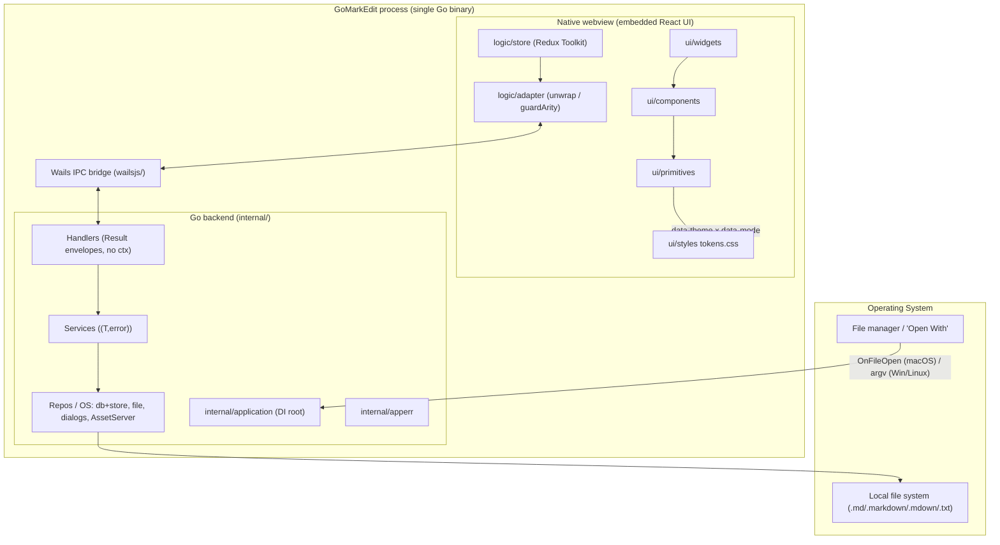

**Status:** Accepted
**Owner:** architect
**Audience:** architect, coder, tester
**Last Updated:** 2026-07-10
**Cross-references:** `00_Foundation/04_DESIGN_DECISIONS.md`, `02_Architecture/02_BACKEND_GO.md`, `02_Architecture/03_FRONTEND_REACT.md`, `02_Architecture/04_WAILS_INTEGRATION.md`, `06_Process_and_Traceability/01_MODULE_INVENTORY.md`, `08_Decisions/ADR-0001`, `08_Decisions/ADR-0006`

# System Architecture

GoMarkEdit is a single native desktop binary. A Go backend embeds a compiled React/TypeScript UI and
renders it through the platform-native webview (WebView2 on Windows, WKWebView on macOS, WebKitGTK on
Linux). There is no bundled Chromium, no local HTTP server exposed to the network, and no runtime
dependency on any remote service (DD-01, DD-02, DD-32; ADR-0001). This document fixes the top-level
shape; the layer-specific contracts live in `02_BACKEND_GO.md`, `03_FRONTEND_REACT.md`, and
`04_WAILS_INTEGRATION.md`.

## Table of Contents

1. Overview
2. Process model
3. Data flow
4. Layer boundaries

## Overview

One Go process owns the OS window, the SQLite settings store, the local file system, the OS
integration points (file dialogs, file associations, the guarded asset server), **and the single
authoritative application model** — the open documents and their content, the tab set, the workspace,
and all UI/layout state (DD-62; `#data-flow`, `02_BACKEND_GO.md#application-model`). The webview owns
**presentation and interaction only**: it renders a projection of that model and forwards user intents as
commands (DD-63; `03_FRONTEND_REACT.md#state-ownership`). The two halves communicate only through Wails'
generated IPC bridge; the backend never renders and the frontend never touches the disk directly, holds
no authoritative state, and keeps only the visible editor's working buffer (debounce-synced to the
backend, DD-64).



The embedded assets are compiled in via `//go:embed all:frontend/dist` (see `04_WAILS_INTEGRATION.md`
`#embed`). Document-referenced local images are served on demand through a guarded `AssetServer.Handler`
with a directory allowlist (DD-21); the app itself originates no background network requests, and in
Stages 1–2 none at all — the sole outbound call is the user-invoked Stage-3 LLM inference to the
configured provider (DD-32 as revised; `08_LLM_INTEGRATION.md`).

## Process model

GoMarkEdit is **multi-instance** and VS-Code-like: there is **no single-instance lock** (DD-08;
ADR-0006). Opening a second file from the OS may launch a new process/window. Because instances are
separate OS processes that all read and write the same settings database, the SQLite file is opened
with **WAL journaling + `busy_timeout`** and a single-writer connection pool, so concurrent instances
share it safely (DD-13; see `05_STATE_AND_PERSISTENCE.md` `#multi-instance-db`). GoMarkEdit deliberately
uses **no single-instance lock** and relies solely on the WAL-based concurrency guarantees.

Within one process there is exactly one long-lived Wails runtime context (captured in `OnStartup`),
one DI root (`internal/application.ApplicationContextHolder`), one open `*db.Database`, and one webview.
Long, exclusive operations (PDF export, format-all) are serialized by a process-wide single-flight
`internal/gate` (see `07_LARGE_FILES_AND_CONCURRENCY.md` `#gate`).

## Data flow

Every backend interaction follows one direction and one envelope contract:

```
UI event (widget)
  → Redux thunk (logic/store)
    → adapter singleton (logic/adapter)      // the only layer importing wailsjs/
      → generated binding (wailsjs/go/...)   // Wails IPC
        → Go handler method                  // returns apperr.*Result, takes no ctx
          → Go service ((T, error))
            → repository / OS resource
          ← (T, error)
        ← apperr.*Result { data | error }
      ← Promise<Result>
    ← unwrap(result)                          // throws + auto-toasts on envelope error
  ← slice state update → re-render
```

The response is always a Result envelope: `{ data?: T; error?: WireError }`. The adapter's `unwrap()`
dispatches `notifyError` and throws when `error` is present, so thunks receive either a value or a
rejection — never a half-filled struct (see `06_ERROR_HANDLING.md`). Long-running backend work
additionally emits Wails **events** (progress) that the adapter subscribes to and dispatches into the
store, rather than returning incrementally (`07_LARGE_FILES_AND_CONCURRENCY.md` `#events-progress`).

**State ownership is unidirectional (MVC; the Go backend is the Model).** The authoritative application
model — open documents + content, tabs, workspace, and UI/layout state — lives in `internal/appmodel`
(DD-62). The frontend's Redux store is a **derived projection** of it (DD-63): on startup/window-open the
adapter calls a query (`GetState`) to hydrate, and thereafter the backend emits **`state:*`** events on
every model mutation, which the adapter applies to the projection. A UI interaction is therefore a
**command** to the backend, not a local truth mutation — the loop is `command → model mutation →
state:* event → projection → re-render`. The one exception is the active editor buffer: Monaco holds the
visible document's working copy and **debounce-pushes** it to the model via `UpdateBuffer` (DD-64); the
backend stays authoritative and never echoes buffer text back into the focused editor.

OS-initiated opens (double-click, "Open With") enter through a different door: the path arrives via
`OnFileOpen` (macOS) or the first CLI argument (Windows/Linux), is normalized by `internal/fileassoc`,
and is routed into an `internal/appmodel` `OpenDoc` command in the configured default open mode
(DD-26, DD-27); the resulting tab/document change reaches the frontend as a `state:patch` event
(`04_WAILS_INTEGRATION.md` `#file-associations`).

## Layer boundaries

The architecture is a strict, inward-pointing dependency graph. Each boundary is enforced by a rule
file (`.claude/rules/`) and an architecture check in `just check`:

- **Backend layering is `Handler → Service → Repository`.** Handlers are the only Wails-bound surface;
  they return a concrete `apperr.*Result` and take no `context.Context`. Services hold `(T, error)`
  signatures and business logic. Repositories/OS adapters touch SQLite, the file system, and OS
  dialogs. `internal/apperr` sits at the bottom and imports no other internal package.
- **`internal/application` is the one composition root.** It is the only place concrete implementations
  are wired, using two-phase DI (nil repositories in the constructor, real repositories injected in
  `Init(ctx)` after the DB opens). See `02_BACKEND_GO.md` `#di-two-phase`.
- **The Go backend is the single source of truth (MVC Model).** `internal/appmodel` owns the live
  application model; the frontend holds no authoritative state, only a projection and the visible editor's
  working buffer (DD-62/DD-63/DD-64; `02_BACKEND_GO.md#application-model`,
  `03_FRONTEND_REACT.md#state-ownership`).
- **The frontend never imports `wailsjs/` outside `logic/adapter/`.** Components and thunks call adapter
  singletons; the adapter owns envelope unwrapping and arity guarding.
- **Presentation is token-only.** One layout; themes swap CSS custom properties via `data-theme` ×
  `data-mode` on `document.documentElement`. No component hardcodes a color (DD-28, DD-30; ADR-0005).
- **Offline is a whole-app invariant, not a layer.** No layer may make a background/unsolicited
  network call; all rendering assets are bundled. The sole permitted socket is the user-invoked
  Stage-3 LLM inference to the configured provider (DD-32 as revised; `03_NonFunctional/04_OFFLINE.md`
  §6, `08_LLM_INTEGRATION.md`).

Modules are enumerated authoritatively in `06_Process_and_Traceability/01_MODULE_INVENTORY.md`; every
story cites a module path from there.
